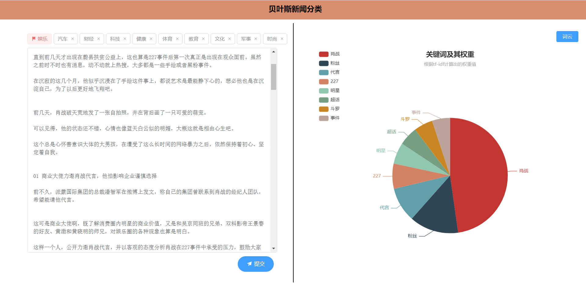

## 贝叶斯新闻分类

### 项目简介

项目是本学期期末一个大作业，正好最近在学习机器学习，拿这个大作业练练手，顺便学一下flask框架，将数据处理以及算法调用和前后端整合在一起。。

项目实现网上找了一份新闻数据集，在 `dataTreating.py`程序里进行数据处理。

因为是web项目，在内存中反复读取数据集，然后模型训练这个过程请求延迟非常恐怖，所以我实现将处理好的数据存入mongodb数据库，然后在`newsClassify.py`中从数据库中查询处理好的数据，进行模型训练。

最后将前端传过来的处理好的文本送到模型里进行预估，得出预估的新闻类别，返回给前端。

另外为了丰富网页内容，我对前端传入的新闻文本做了tf-idf特征抽取（这里使用`jieba.analyse.extract_tags`）,取得8个关键字以及它们的权重，将数据用图表展示出来。

最后将处理好新闻文本生成词云，选择七牛云作为前后端分离工程中的图片服务器，供后端上传文件，前度访问文件链接。

多说一嘴，这大概是我第一个人工智能项目，经历下来总结：机器学习流程中最麻烦的还是数据处理这个步骤，这过程真的是太搞心态了。

***成品图***




### 项目启动

#### 1.将数据存入数据库

- 在`dataTreating.py`的main模块里调用main函数

  ```python
  if __name__ == '__main__':
      main()
  ```

#### 2.启动web服务器

- 在python目录下运行 `server.py`

#### 3.启动前端工程

- 安装http-server  `npm i -g http-server`
- 进入vue->dist目录下，打开终端，输入 `http-server`

```
目录树

├─python
│  │  .qiniu_pythonsdk_hostscache.json
│  │  dataTreating.py
│  │  keyWordCloud.py
│  │  newsClassify.py
│  │  server.py
│  │  txt.py
│  │  
│  ├─data
│        simhei.ttf
│        stopwords.txt
│      	 val.txt
│        wordcloud.png         
└─vue 
    ├─dist
    │           
    ├─public
    │         
    └─src
            App.vue
            main.js
            request.js
            
```


### 项目讲解

待续……
